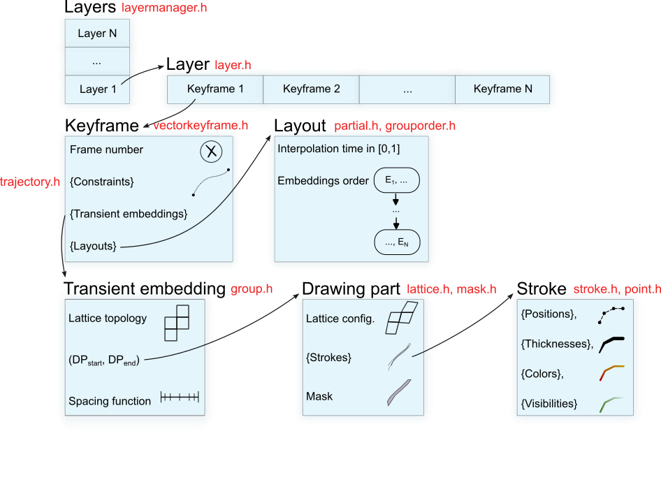

# Frite

**Frite** is a non-linear 2D animation software developed as part of the [MoStyle ANR project](https://mostyle.github.io/) by Melvin Even, Pierre Bénard and Pascal Barla. 

The animation system is described in the following publications:

- [Non-linear Rough 2D Animation using Transient Embeddings.](https://inria.hal.science/hal-04006992) Melvin Even, Pierre Bénard, Pascal Barla. Computer Graphics Forum (Eurographics), Wiley, 2023.
- [Inbetweening with Occlusions for Non-Linear Rough 2D Animation.](https://inria.hal.science/hal-04797216) Melvin Even, Pierre Bénard, Pascal Barla. Research Report RR-9559, 2024.
 

It is originally based on [Pencil2D](https://www.pencil2d.org/).

**Note:** This is research software. As such, it may fail to run, crash, or otherwise not perform as expected. It is not intended for regular use in any kind of production pipeline.


## Dependencies
- [Eigen](https://eigen.tuxfamily.org/index.php?title=Main_Page)
- [Clipper2](https://github.com/AngusJohnson/Clipper2)
- [CPD](https://github.com/gadomski/cpd)
- [FGT](https://github.com/gadomski/fgt)
- [nanoflann](https://github.com/jlblancoc/nanoflann)
- [quazip](https://github.com/stachenov/quazip)

They are automatically downloaded by `cmake` during the project configuration.

## Build instructions

1. Download and install **Qt 6** open source (https://www.qt.io/download)
2. Clone the repository and follow the build instructions depending on your OS:

### On Linux/macOS

Tested on Ubuntu 20.04 with GCC 9.3.0 and macOS (12.6) with Clang 14.

    cd frite
    mkdir build
    cd build
    cmake -DCMAKE_BUILD_TYPE=Release ..
    make

### On Windows

Tested on Windows 10 with Visual Studio 2019, `cmake-gui` and `vcpkg` (https://github.com/microsoft/vcpkg)

Packages to install with vcpkg:
* libjpeg-turbo:x64-windows
* libpng:x64-windows
* zlib:x64-windows

Build:

    cd frite
    mkdir build
    cd build
    cmake -G "Visual Studio 16 2019" -A x64 -DCMAKE_BUILD_TYPE=Release -DCMAKE_PREFIX_PATH=<path to Qt cmake dir> -DCMAKE_TOOLCHAIN_FILE=<path to vcpkg cmake> -DVCPKG_TARGET_TRIPLET=x64-windows ..
    cmake --build . --config Release

Or open the Visual Studio solution.


## Multi-touch Wacom tablet on Ubuntu

For multi-touch inputs in Qton Ubuntu, "gestures" must be disabled. 
In the terminal, run the commands:

``` sh
xsetwacom --list devices
# trouver l'id correspondant au type TOUCH (ici 13)
xsetwacom --get 13 Gesture off
```

## Keyboard shortcuts

#### Tools shortcuts

| Action               | Shortcut                                      |
|:-------------------- | ---------                                     |
| Draw                 | *P*                                           |
| Erase                | *E*                                           |
| Pan                  | Hold *middle mouse button* or *H* to toggle   |
| Select group (lasso) | *S*                                           |
| Create group (lasso) | *G*                                           |
| Warp selected groups | *W*                                           |
| Make correspondences | *Shift+M*                                     |
| Trajectory           | *T*                                           |
| Spacing              | *I*                                           |

#### Actions shortcuts

| Action                                         | Shortcut                |
|:---------------------------------------------- | ----------------------- |
| Toggle onion skin                              | *O*                     |
| Clear frame                                    | *K*                     |
| Automatic registration *                       | *M*                     |
| Single-step registration *                     | *Ctrl+M*                |
| Regularize lattice                             | *R*                     |
| Add breakdown                                  | *B*                     |
| Toggle cross-fade                              | *Shift+C*               |
| Copy selected groups into the next keyframe    | *C*                     |
| Delete selected group                          | *Del*                   |
| Select all groups                              | *Shift+A*               |
| Deselect group                                 | *Esc* or *Ctrl+Shift+A* |
| Deselect groups in all layers and keyframes    | *Shift+Esc*             |

\* For these actions holding *Ctrl* will use the entire next keyframe as the registration target. 

#### Timeline shortcuts

|              Action              |    Shortcut               |
|----------------------------------|---------------------------|
| Play/pause                       | *Spacebar*                |
| Change frame                     | *Left/right arrow*        |
| Change keyframe                  | *Ctrl + left/right arrow* |

### Code

#### Structures



#### Algo contributions:
- layoutmanager.h (automatic layout computation and propagation)
- visibilitymanager.h (automatic visibility thresholds computation)
